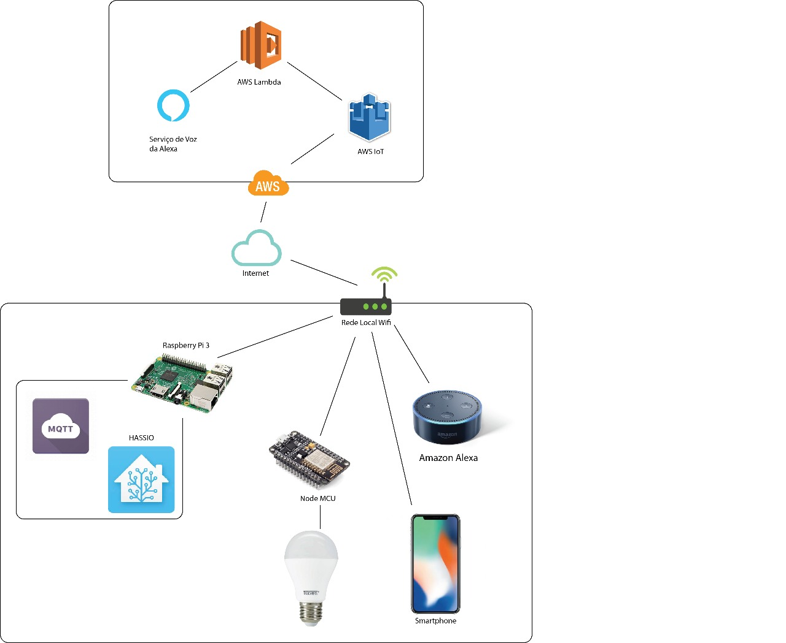
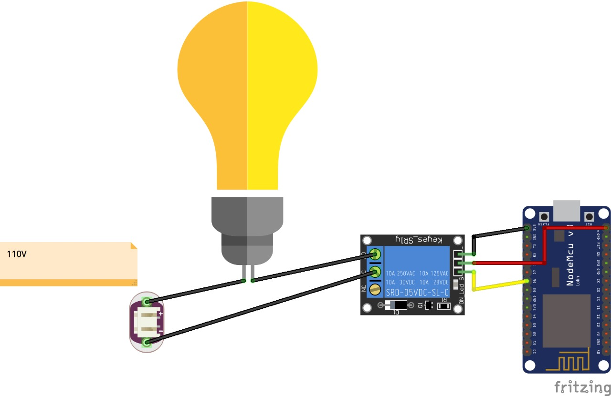
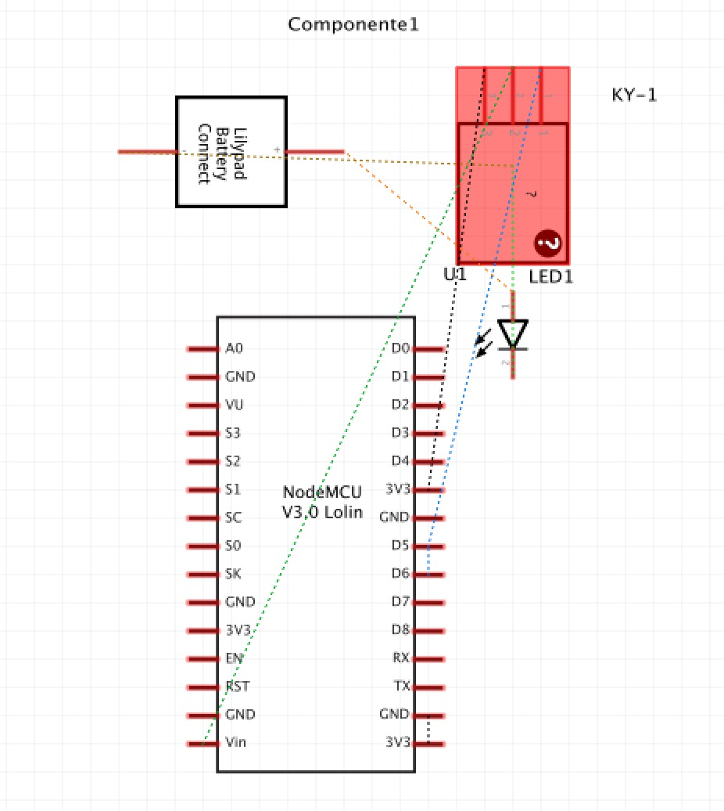

# Objetos Inteligentes Conectados

## Nome do Projeto: Automação Residencial

O projeto é uma demonstração de como automatizar iluminação da casa, sendo que o usuário pode ligar e desligar apartir de comandos de voz com a Alexa ou Siri.

O esquema abaixo demonstra as diferentes camadas do sistema, isso incluí, uma camada de rede local e uma na internet, no serviço AWS da Amazon.

Na rede local, a Alexa reconhece o comando de voz, e envia para o servidor da Amazon.
A Amazon retorna para o seridor local, que roda em um RaspberryPi o comando interpretado.
O RaspberryPI roda um sistema operacional chamado hassio ( http://www.home-assistant.io ) que interpreta o comando e envia através do protocolo MQTT para o NodeMCU que está conectado à rede local.
O NodeMCU recebe o comando e aciona a porta D5, onde está conectado um módulo rele que derve de interruptor para a lâmpada (ou outro dispositivo desejado).

## Diagrama de implantação

## Montagem do dispositivo

## Esquema

